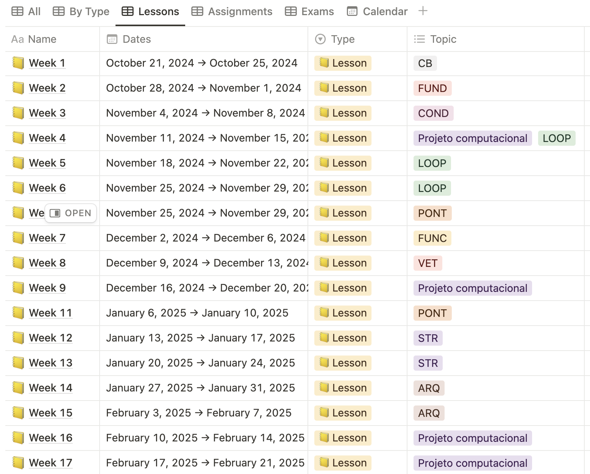

# Computação para Engenharia (CPE)
## Objetivo
A disciplina se propõe a apresentar uma introdução ao desenvolvimento de algoritmos e de programas para a solução de problemas computacionais. Ao final do curso, espera-se que o aluno seja capaz de:
• entender os princípios básicos da programação de computadores;
• compreender e desenvolver algoritmos elementares;
• ler, escrever e entender códigos computacionais escritos em linguagem de alto nível;
• entender as estruturas básicas de programação (abstração de dados, operações, subprogramas e modularização, endereçamento de memória);
• desenvolver e implementar programas de pequeno e médio porte, utilizando os princípios da programação procedimental.

## Ementa do programa
1. Introdução. Arquitetura e organização de computadores. Algoritmos e lógica de programação. Paradigma de programação procedimental.

2. Fundamentos da Linguagem de Programação. Estrutura geral de um programa. Variáveis e tipos de dados. Operadores aritméticos, lógicos e relacionais. Precedência. Entrada e saída formatadas.

3. Laços e Comandos de Repetição.

4. Comandos e Testes Condicionais. Expressões relacionais, expressões lógicas.

5. Funções. Princípios de estruturação de programas. Declaração e definição de funções. Passagem de argumentos por valor e por referência.

6. Arranjos. Arranjos unidimensionais (vetores) e multidimensionais (matrizes). Organização de arranjos na memória.

7. Ponteiros. Definições. Endereçamento da memória. Aritmética e operações com ponteiros. Aplicações.

8. Cadeias de Caracteres. Representação de cadeias de caracteres. Funções de manipulação de strings das bibliotecas padrões. Aplicações.

9. Manipulação de Arquivos. Definição e formas de acesso a arquivos. Funções e operações sobre arquivos de texto. Funções e operações sobre arquivos binários.
## Metodologia

* Os autores Lilian Bacich e José Moran destacam: uma abordagem teórico-prática.
* O autor Paulo Freire, em seu livro “Pedagogia da Autonomia” destaca que:
o processo de ensino e aprendizagem está em conexão com a perspectiva
construtivista, no qual as partes interessadas trocam conhecimentos.
* Na disciplina de Algoritmos e Estruturas de Dados serão abordadas as
metodologias de ensino supramencionadas.

## Critérios de avaliação
* Duas Provas práticas de pesos distintos, Lista de exercícios e um Projeto computacional.
* Para o cálculo da média final da disciplina, consideram-se as seguintes
medidas:

Módulo 01: $M01 = P1$

Módulo 02: $M02 = P2$

Módulo 03: $M03 = PC$

Média Final: $MF = (M01 + M02 + M03) / 3$

O aluno terá de satisfazer os seguintes requisitos, para obter a aprovação na disciplina:

**Aprovação** se NF ≥ 5,0 e se Percentual de faltas (PF) for PF < 25%. Onde PF é dado pelo número de aulas com faltas registradas dividido pelo número de aulas ministradas.

**Reprovação** se NF < 5,0 ou se PF 25%, então o aluno será considerado reprovado por nota ou por falta. Não serão aceitas atividades fora do prazo e por e-mail.

**Pontualidade na entrega das avaliações**. O não recebimento dos trabalhos, projeto e/ou tarefa; ou a não apresentação do mesmo acarretará na perda dos pontos correspondentes.
As notas no Projeto Computacional serão correspondentes a participação e apresentação nas prévias referentes ao Projeto. Portanto, o aluno precisa participar das prévias e da apresentação final. (1) O aluno receberá nota = 1,0 (10% da nota do projeto), caso participe apenas da apresentação final e; (2) O aluno receberá nota = 1,0 (10% da nota do projeto), caso participe apenas das prévias. Dentre os critérios que serão avaliados no PC, destacam-se: atualidade, complexidade, relevância, implementação e características reconhecidamente exitosas ou inovadoras.

Caso o aluno falte a alguma das provas e apresente atestado médico, terá como média final na disciplina a média aritmética dos demais módulos.

## Cronograma
**Conteúdo**

**Ensaios de trabalho**

**Provas**

## Bibliografia básica
1. Bjarne Stroustrup. *Programming: Principles and Practice Using C++*. 2. Pearson. 2014
2. Bjarne Stroustrup. *The C++ Programming Language: Special Edition*. 4. Pearson. 2013
3. Rodrigues, Pimenta. Programação Em C++ - Algoritmos e Estrutura de Dados - 3ª ed - Editora: LIDEL - ZAMBONI, 2012

## Bibliografia complementar
1. Allen B. Downey. *Pense em Python*. Novatec. 2016
2. Eric Mathes. *Curso Intensivo de Python: uma Introdução Prática e Baseada em Projetos à Programação*. 3 ed., Novatec. 2023.
5. Guimarães, A. M.; Lages, N. A. C. - *Algoritmos e estruturas de dados*. 2ª ed., LTC, Rio de Janeiro, 1994.
[isocpp](https://isocpp.org/get-started)
[Bjarne's tour](https://isocpp.org/tour)
[cpp reference](https://en.cppreference.com/w/)
[python docs](https://docs.python.org/3/)
